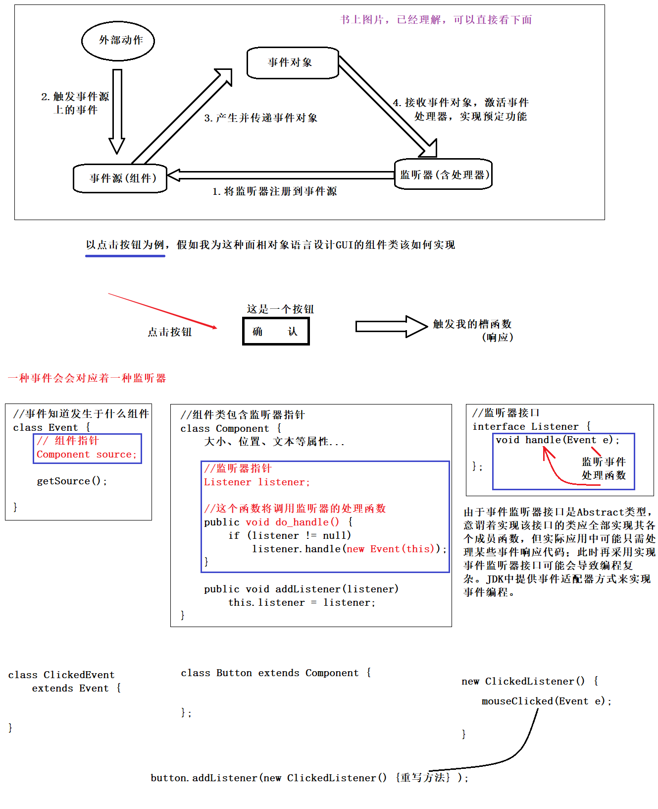

```
public class Demo {
    public static void main(String[] args) {
    	//理解：Person类就好比组件、Listener就好比监听器、Event就是事件超类
        Person p=new Person(1001,"张三");
        
        //这就相当于给组件添加监听器
        p.refisterListener(new PersonListener() {
            public void do_run(Event e) {
                Person p=e.getSource();
                System.out.println("Who is in front of people to have a meal, that is "+p.getName());
            }
            
            public void do_eat(Event e) {
                Person p=e.getSource();
                System.out.println("Who in the previous run, that is "+p.getName());
            }
        });
        
        p.eat();
        p.run();
    }
}

//观察者设计模式
//这相当于一种组件
class Person {    
    private Integer id ;
    private String name;
	
	//Setter and Getter and 构造(忽略不计)
    public Integer getId();
    public void setId(Integer id);
    public String getName();
    public void setName(String name);
    public Person(Integer id ,String name);
	
    //这是重点，这个就是一个事件源，是一个监听器的指针
    private PersonListener listener;
	
	//下面这两个方法是重点，调用监听器中重写的方法
    public void eat() {
        if(listener != null) {
        	//这个方法也是重点，使用该类构造事件对象
            listener.do_eat(new Event(this));
        }
        System.out.println("this is eat!");
    }
	
    public void run() {
        if(listener != null) {
            listener.do_run(new Event(this));
        }
        System.out.println("this is run!");
    }
	
    public void refisterListener(PersonListener listener) {
        this.listener = listener;
    }
}

//事件监听器，一种事件对应一种监听器
interface PersonListener {
	//这是重点，相当于监听器的处理函数，函数参数即为事件对象
    public void do_eat(Event e);
    public void do_run(Event e);
}

//这个是事件对象
class Event {
    //事件对象   需要封装事件源对象
    private Person source;

    public Person getSource();
    public void setSource(Person source);
    public Event() {
        super();
    }
    
    //这个是重点，以组件指针构造事件
    public Event(Person source) {
        super();
        this.source = source;
    }
}
```

